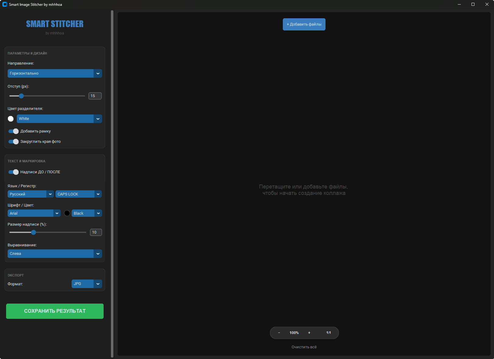

# Smart Image Stitcher 📸

Удобный инструмент для быстрого создания профессиональных коллажей типа **«ДО / ПОСЛЕ»**. Программа позволяет объединять изображения, настраивать их внешний вид, добавлять автоматические надписи и экспортировать готовый результат.

---

## ✨ Возможности
*   **Гибкое объединение**: Склейка фотографий по горизонтали или вертикали.
*   **Параметры и дизайн**: Настройка отступов (padding), добавление рамки и скругление углов у фото.
*   **Цветовая палитра**: Выбор цвета разделителя из предустановленной библиотеки (в стиле Pantone).
*   **Умные надписи**: Автоматическое добавление меток «ДО / ПОСЛЕ» с выбором шрифта, размера, цвета и выравнивания.
*   **Превью в реальном времени**: Встроенный зум и удобный просмотр результата перед сохранением.
*   **Экспорт**: Сохранение в форматах JPG и PNG.

## 🚀 Установка

1. Склонируйте репозиторий или скачайте архив.
2. Убедитесь, что у вас установлен [Python](https://www.python.org/).
3. Запустите файл `install.bat`, чтобы автоматически установить необходимые библиотеки.
 
